<h1 align="center">
	42-São Paulo: Labs
</h1>

<p align="center">
	<b><i>Documentação do Projeto</i></b><br>

[DESAFIO.MD](README.md/#-referencias)
## 🗣️ Resumo Desafio
- Criar uma API REST que retorna o LOG em um arquivo
- Criar uma aplicação CLI que consome o arquivo com os logs mostre o resultado

para mais detalhes sobre o desafio, acesse o link na sessao referencias

A proxima sessão vai dar uma visão macro sobre as duas aplicações

### 💎 API Rest
- A API trabalha com 3 métodos: GET, POST e DELETE e 3 rotas: a raiz /, /me e /database
- O resultado das requisições são armazenados em um arquivo de formato txt chamado logs
- Dependendo do método e da rota usada consiguimos obter resultados diferentes que serão descritos a seguir

#### Rota raiz - /

Na rota raiz a API trabalha apenas com o método GET e faz uma requisição para uma outra API externa chamada Kanye REST (link em referencias) que retorna aleatóriamente em formato JSON pérolas ditas pelo famoso e polemico raper

#### Rota sobre - /me

Nessa rota a API também trabalha apenas com o método GET e retorna em formato JSON informações sobre o seu criador

#### Rota banco de dados - /database

Aqui é onde a API trabalha GET, POST e DELETE. Consumindo, adicionando e deletando dados de um banco de dados relacional MYSQL

#### Arquivo logs.txt

O arquivo contém as seguintes informações sobre a requisição:
- Método Utilizado
- Hora da requisição
- Rota Utilizada
- Status Code da requisição

### 👽 Aplicação CLI
- A aplicação consome o arquivo gerado pela API e as retorna no terminal
- Essas informações podem ser exibidas em formatos diferentes de acordo com a solicitação

### 🔨 Ferramentas Externas
Para esse projeto foi utilizado algumas ferramentas que serão resumidas a seguir e aprofundadas posteriormente. Lembrando que todos os links estao na sessão referências

#### Mongoose
- O motor da API. Mongoose é um web server que permite receber e gerênciar as requisições do cliente.
	
#### Lib Curl
- Uma biblioteca muito fofis que faz todo o trampo de requisição que foi utilizado para receber o JSON da outra API
	
#### MySQL
- Dispensa apresentações? Um dos bancos de dados mais famosos do mercado.
	
#### MJSON
- Uma biblioteca que ajuda a converter strings para JSON e vice e versa.

#### Thunder CLient
- Uma ferramenta DELICINHA que usada durante todo o desenvolvimento para fazer testes.

### 🌀 Me pede que eu faço, amor
Ta bom, mas como tudo isso funciona NA PRÁTICA?.


#### Rota Raiz - /

- Na rota raiz a API trabalha com o metodo GET, então tudo que o cliente PRECISA fazer é um GET (uau)
	
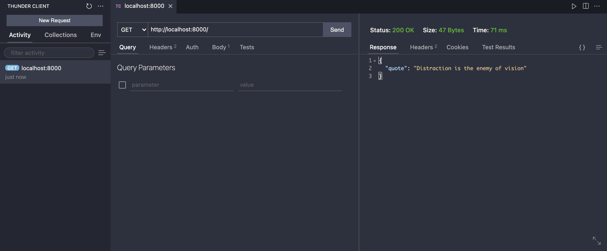


- É muito importante essa informação, pois qualquer outro metodo é retornado um 404


#### Rota sobre - /me

- O mesmo acontece na rota sobre, a API trabalha apenas com o GET.

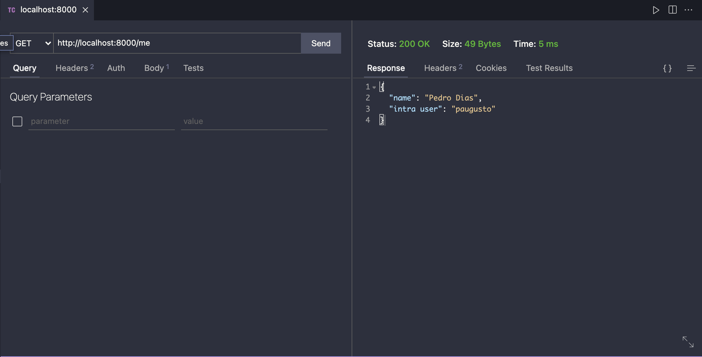

- Caso não seja esse método, 404 novamente.

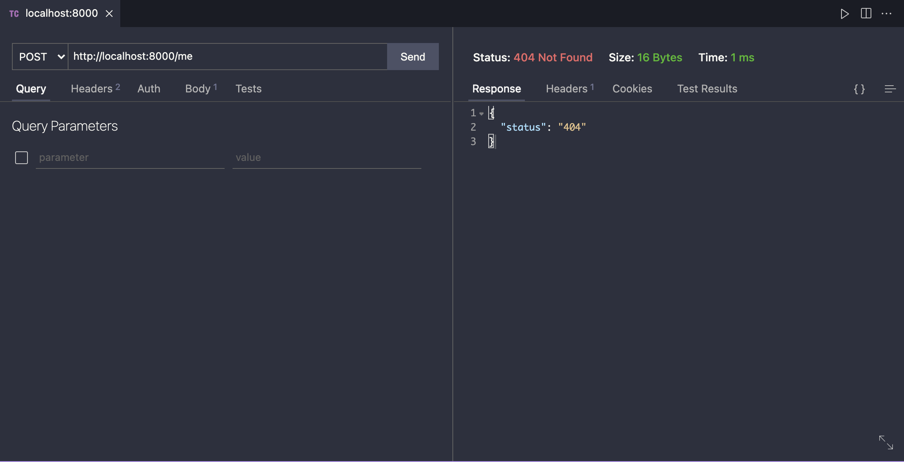

#### Rota database - /database

- Na rota de banco de dados podemos usar 3 métodos:

##### GET: Para obter informações de todos os itens do banco de dados.

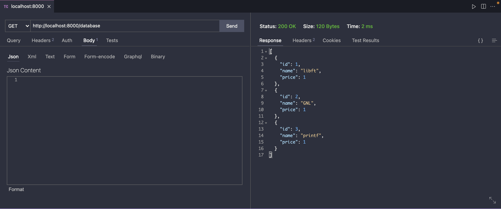

##### POST: Para adicionar um item no banco de dados.

- Nesse caso no body da requisição PRECISA ter um arquivo no formato JSON com os detalhes do item a ser adicionado

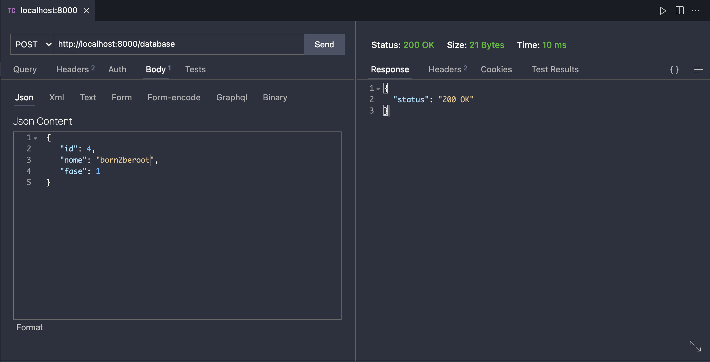
	
- Caso a informação esteja errada ou incompleta, bad request é retornado

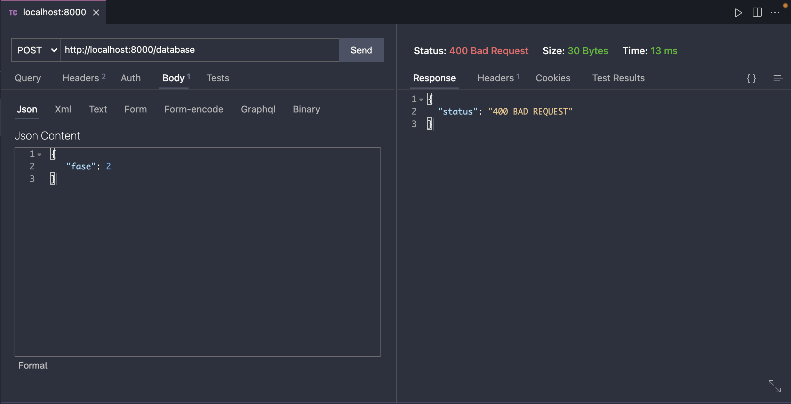

##### DELETE: Para deletar um item do banco de dados
	
- O delete é feito atravez do ID do item que vai ser removido
- Nesse caso no body da requisição PRECISA ter um arquivo no formato JSON
	
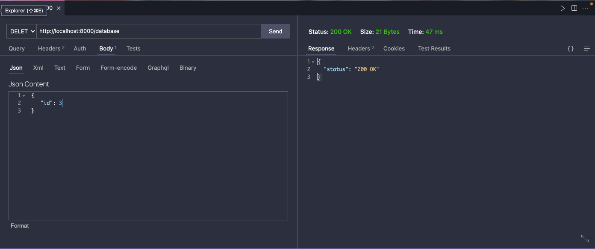
	
### 💬 Relatorio Organizado

TUDO LINDO, agora bora acessar o relatorio gerado pela aplição CLI

##### Primeiro, compila o arquivo da pasta cli com o comando abaixo para gerar o executavel cli
```
make
```
	
temos algumas opções de execução, são elas:

##### lista: Para obter uma lista com todas as informações das requisições feitas
```
./cli lista
```
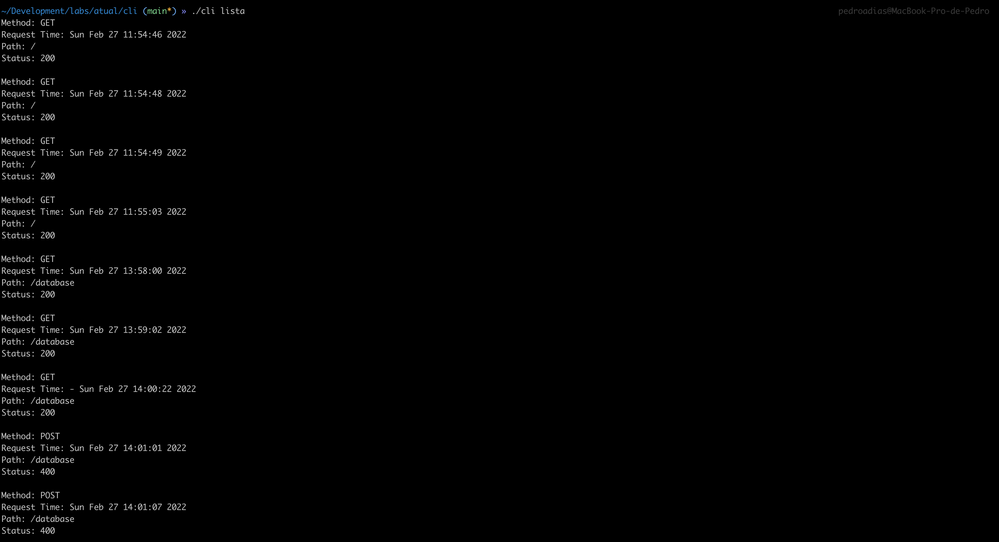

##### tabela: Para gerar uma tabela com informações compiladas de todas as requisições
```
./cli tabela
```
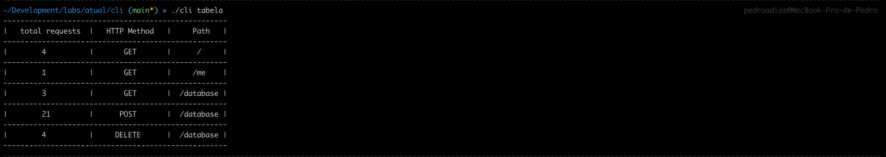

##### ultimo_request: Para obter a informação da última request feito
```
./cli ultimo_request
```
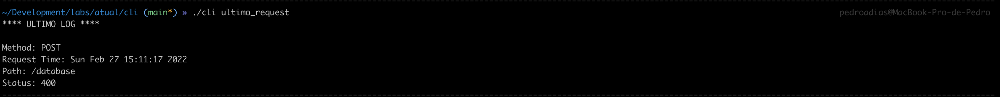

É importante especificar uma opção, caso o contrario ocorrerá um erro. Mas não se preocupe, o programa vai mostrar as opções caso isso aconteça.

##### Sem opção
```
./cli 
```

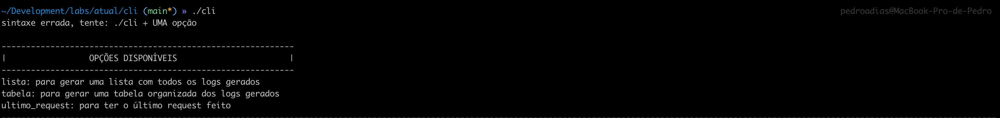

##### Opção errada
```
./cli bla
```
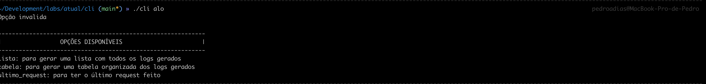

### 💋 Referências

- Mongose -> https://mongoose.ws/documentation/
- MJSON -> https://github.com/cesanta/mjson
- MySql -> https://www.mysql.com
- Thunder Client -> https://www.thunderclient.com
- Desafio Completo-> [DESAFIO.MD](DESAFIO.md)
	
